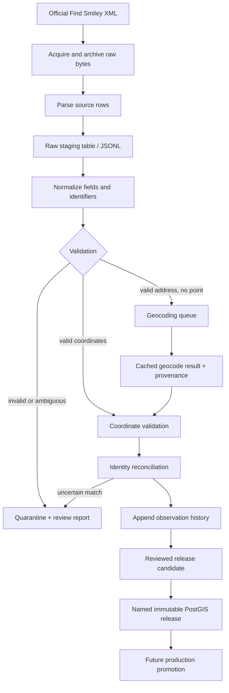

# Denmark data flow

Governed by [ETHICS.md](../../ETHICS.md). Source preservation and history below are defaults for permitted evidence; authorized removals take precedence. Classification/geocoding success does not authorize publication. Suppress residential/private addresses and associated coordinates under the policy, and apply restrictions to exports, older releases, reimports, and restores. Remaining enforcement work is tracked in the [policy checklist](../../governance/policy-implementation-todo.md).

The pipeline keeps the original source separate from every interpretation made by the project. Each stage produces an inspectable artifact or database state and records the code version, timestamp, and input hash.

## Stage meanings

1. **Acquire:** download the official XML, record URL, retrieval time, HTTP metadata, byte count, and SHA-256. Never modify this file.
2. **Parse:** convert XML elements into one row per source record. Preserve every source field and the source row identifier. Parsing does not decide which records are relevant.
3. **Stage:** store the parsed representation in a temporary or raw-staging table/JSONL file. This makes parser output reviewable before canonical modeling.
4. **Normalize:** map Danish field names and values to canonical fields such as name, address, activity, species, inspection date, and source identifier. Preserve the original value alongside the normalized value where interpretation occurred.
5. **Validate:** check required identifiers, coordinate bounds, dates, country, duplicate source keys, unexpected categories, and record-count changes. Invalid rows are quarantined rather than silently dropped.
6. **Geocode:** queue only records without usable coordinates. Normalize the address, query a permitted geocoder, cache the request/result, and store provider, timestamp, query, returned precision, and confidence/status. Geocoding is an enrichment, not a replacement for source evidence.
7. **Coordinate review:** distinguish source coordinates, geocoded coordinates, and unresolved coordinates. Flag town-centroid or low-precision results and do not present them as exact facility locations.
8. **Reconcile identity:** match source records to durable project facilities using stable source IDs first, then deterministic address/name rules. Ambiguous matches require review. A match decision is stored, not hidden in a script.
9. **Append history:** create a dated observation linked to the acquisition run and source artifact. Do not overwrite the previous observation.
10. **Release:** generate additions, removals, changes, geocoding coverage, validation findings, and unresolved conflicts. After review, publish a named release. A failed run leaves the previous release active.

## Storage boundaries

The raw XML remains in artifact storage. Staging can be a local JSONL/CSV plus a database table during development. The maintained PostgreSQL/PostGIS database stores normalized records, coordinates, provenance, observations, decisions, and releases. The final public dataset is a view or release membership over reviewed observations—not a destructive rewrite of the raw data.

## Coordinate policy

Development provider: DAWA (`https://api.dataforsyningen.dk/adresser`) is approved for local development only. This choice must be reevaluated before production because the current Dataforsyningen documentation warns that DAWA is closing. The provider is configurable and must not be embedded in domain logic.

For a Danish record:

- source latitude/longitude: retain exactly as supplied, with `coordinate_method=source`;
- address-only record: retain the missing source point and add a separate geocoded candidate;
- successful geocode: store provider, query, retrieved timestamp, precision, and review state;
- failed geocode: keep the facility searchable by address but exclude it from radius results;
- uncertain or low-precision geocode: require review or label the result as approximate.

The project should never replace a missing coordinate with a guessed point without recording how that point was produced.
